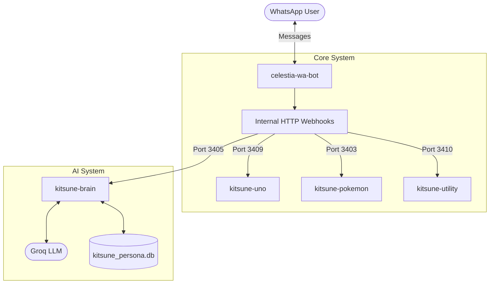
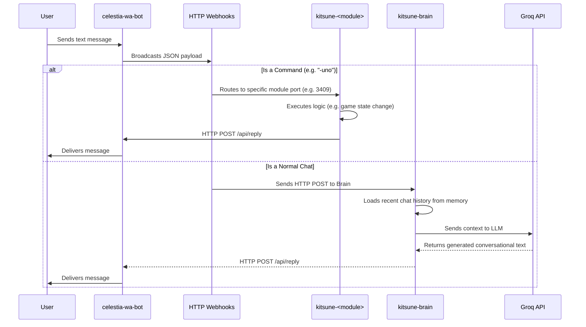

# Kitsune WhatsApp Bot

This is a powerful, microservice-based WhatsApp bot built using Node.js and `whatsapp-web.js`. It functions as an active participant in group chats, offering an AI conversational agent (using Groq LLMs), a fully-featured Pokémon mini-game, an interactive UNO multiplayer game, and various administrative and utility commands.

## Table of Contents

1. [History](#history)
2. [Features](#features)
3. [Architecture Overview](#architecture-overview)
4. [How to Set It Up](#how-to-set-it-up)
5. [Environment Variables Guide](#environment-variables-guide)
6. [Detailed Component Breakdown](#detailed-component-breakdown)
7. [The Flow of a Message](#the-flow-of-a-message)
8. [Command Reference List](#command-reference-list)
9. [Data Structures & Schemas](#data-structures--schemas)
10. [Advanced Deployment Options](#advanced-deployment-options)
11. [Guide for Developers](#guide-for-developers)
12. [Troubleshooting & FAQ](#troubleshooting--faq)
13. [License](#license)

---

## History

The creation of this bot started when my friends and I made a WhatsApp group chat. It was a great space where we spent time daily chatting, roasting each other in friendly fire, and talking about games, movies, and more. To make things even more fun, I decided to build a bot with basic commands like `kick`, `slap`, `kiss`, and `meme`. The group members loved it, and my goal became to bring a Discord-like environment directly into WhatsApp.

After a few days, I noticed people in the group were talking a lot about Pokémon. Inspired by Discord bots like Pokétwo and Dank Memer, as well as Pokémon GO and Pokémon TCG, I combined all those ideas and created a fully-fledged Pokémon feature for the bot.

At that time, the bot was named **Celestia**. I later added "family codes" to create families within the group chat (inspired by the Discord marriage bot).

The biggest evolution happened when I decided to add AI. That's when Celestia became **Kitsune**, inspired by an Indonesian Instagram content creator named Kitsune. I didn't want the AI to just be a tool or an assistant; I wanted it to adapt, learn from the group chat, and feel like a human participant in our conversations. I initially used Ollama, but eventually transitioned to using Ollama to refine the context and sending it to Groq for better, faster results. Soon after, I added live weather, a math tool, browser search, and other utilities.

Eventually, I decided to stop active development on this project because it had achieved everything I wanted for our group. I've now pushed it open-source so that if anyone else wants to use it and bring that same fun to their own group chats, they can do so freely.

---

## Features

- **🧠 Conversational AI (Kitsune):** Powered by Groq LLMs, the bot adapts, learns from the group chat, and converses naturally with users using memory and context.
- **⚡ Pokémon RPG:** Catch, battle, and trade Pokémon right in your WhatsApp chat. Features a full inventory system and interactive battles.
- **🃏 UNO Multiplayer:** Play UNO with your friends! Features custom lobbys, AI bot opponents, playable cards, visual hands, and auto-draw penalties.
- **🛠️ Microservice Architecture:** The bot is split into over 15 individual, independent modules running on PM2. If one module (like UNO or Memes) crashes or restarts, the rest of the bot stays online seamlessly!
- **🛡️ Moderation & Utilities:** Ping stats, math solving, weather lookups, warnings, kicks, bans, and anti-link tools.

---

## Architecture Overview

The bot uses a **decentralized microservice architecture** powered by local HTTP APIs and PM2. Instead of one large monolithic script, each feature runs independently.

### Core Modules:
- `celestia-wa-bot`: The central WhatsApp connection client. It handles all incoming and outgoing messages and broadcasts them to the other modules.
- `kitsune-brain`: The AI persona engine that manages conversational context, memory, and LLM requests.
- `kitsune-receiver`: A central log/webhook receiver for network events.
- `kitsune-watchdog`: Monitors network health and restarts modules if things go wrong.

### Feature Modules:
Each feature has its own dedicated PM2 process to ensure maximum stability (e.g. `kitsune-uno`, `kitsune-pokemon`, `kitsune-meme`, `kitsune-utility`, etc.). If one module crashes, the rest of the system remains unaffected.


```mermaid
graph TD
    User([WhatsApp User]) <-->|Messages| CoreAPI[celestia-wa-bot]
    
    subgraph Core System
        CoreAPI --> HTTPBroadcaster[Internal HTTP Webhooks]
        HTTPBroadcaster -->|Port 3409| UNORouter[kitsune-uno]
        HTTPBroadcaster -->|Port 3403| PokeRouter[kitsune-pokemon]
        HTTPBroadcaster -->|Port 3410| UtilRouter[kitsune-utility]
    end
    
    subgraph AI System
        HTTPBroadcaster -->|Port 3405| AIBrain[kitsune-brain]
        AIBrain <--> GroqAPI([Groq LLM])
        AIBrain <--> MemoryDB[(kitsune_persona.db)]
    end
```

---

## How to Set It Up

### Requirements

- **Node.js**: Version 18 or above is required for compatibility with modern JavaScript features.
- **Database**: A MongoDB database connection is required for persistent state (e.g., MongoDB Atlas).
- **LLM Key**: A Groq API key is required to power the AI conversational brain.

### Installation Steps

1. Clone this repository to your local machine:

   ```bash
   git clone https://github.com/your-username/Kitsune-WhatsApp-Bot.git
   cd Kitsune-WhatsApp-Bot
   ```

2. Install all required packages:

   ```bash
   npm install
   ```

   *(If you are on Linux, you might need to install Puppeteer dependencies like `libnss3`, `libatk1.0-0`, `libcups2`, `libxss1`, etc., so the headless Chrome browser can run properly).*
3. Copy the `.env.example` file and rename it to `.env`:

   ```bash
   cp .env.example .env
   ```

4. Open the `.env` file and fill in your details (see the Environment Variables Guide below).
5. Run the bot setup script (Recommended to use PM2):

   ```bash
   npm install -g pm2
   ./scripts/setup-pm2.sh
   ```

6. A QR code will appear in the `celestia-wa-bot` logs. Check the logs (`pm2 logs celestia-wa-bot`) and scan it using the WhatsApp app on your phone (under Linked Devices) to log in. The session will be saved locally in `.wwebjs_auth/`.

---

## Environment Variables Guide

Here is a complete breakdown of every configuration variable available in your `.env` file:

- `MONGODB_URI`: The connection string for your MongoDB instance.
- `GROQ_API_KEY`: The API key you generated from the Groq console. Used to make LLM requests.
- `GROQ_MODEL`: The specific model to use (default is `llama-3.3-70b-versatile`).
- `CONTROL_CENTRE_PASSWORD`: An admin password used to log into the web dashboard API.
- `INTERNAL_API_TOKEN`: A secure token used for internal microservice communication.
- `BOT_OWNER_NAME`: Your personal name. The AI uses this name to refer to its owner and creator.
- `BOT_NAME`: The name of the bot itself (e.g., "Kitsune").
- `BOT_PREFIX`: The character that triggers commands (default is `-`).
- `BOT_FATHER`: A comma-separated list of the phone numbers of the admins (with country codes, like `919876543210`).
- `ALLOWED_ORIGIN`: The production domain for CORS checks on the web dashboard API.
- `DATA_DIR`: Directory where local JSON databases are kept (default is `./data`).

---

## Detailed Component Breakdown

### 1. Main Entry Points

- **`ecosystem.config.js`**: The primary PM2 configuration file that orchestrates the startup of all 16 separate services.
- **`services/celestia-wa-bot.js`**: The central WhatsApp connection using `whatsapp-web.js` or Baileys. It handles session states and proxies all messages to the internal microservices via HTTP.
- **`config.js`**: Parses all environment variables from `.env` and exports them as a central configuration object used across the app.

### 2. Message Handling

- **`handlers/eventHandler.js`**: Re-routed to function as an HTTP middleware in the new architecture. It receives payloads from the core WhatsApp bot, checks the sender's permissions, handles rate limiting, and executes commands.

### 3. The Command Modules

Located in the **`commands/`** folder. Commands are separated into their own respective Express servers.

- **`uno/`**: Contains the logic for the multiplayer UNO game, complete with AI fallback, auto-draw mechanics, and visual cards.
- **`pokemon/`**: Contains the logic for the Pokémon RPG (e.g. `catch.js`, `battle.js`, `exchange.js`, `trade.js`, `use.js`).
- **`utility/`**: Contains helpful commands like `ping.js`, `weather.js`, or `immune.js`.
- **`family/`**: Contains fun, social group commands like `tree.js` or `adopt.js`.
- **`admin/`**: Contains group moderation tools (`kick.js`, `ban.js`, `warn.js`).
- **`meme/`**: Contains commands to generate or fetch memes (`drake.js`, `son.js`, `reddit.js`).

### 4. The AI Brain (`kitsune-brain/`)

- **`server.js`**: The separate Express server for the AI. It builds the prompt context (time, news, memory), talks to the Groq API, processes tool calls, and returns text.
- **`ingest-datasets.js`**: A utility script used to load conversational datasets into the AI's persona engine.

### 5. Data Storage & State (`store/`)

- **`db.js`**: Handles the connection to MongoDB.
- **`pokemonStore.js`**: Manages all MongoDB database operations for the Pokémon game.
- **`messageLogger.js`**: Logs group and private chat histories to local JSON files so the AI can read recent context.
- **`kitsuneMemory.js`**: Interfaces with the SQLite database to save and retrieve long-term AI conversational memory.

---

## The Flow of a Message

To understand how everything works together, here is a detailed sequence of what happens when a user sends a message.


```mermaid
sequenceDiagram
    participant U as User
    participant W as celestia-wa-bot
    participant H as HTTP Webhooks
    participant C as kitsune-<module>
    participant B as kitsune-brain
    participant G as Groq API

    U->>W: Sends text message
    W->>H: Broadcasts JSON payload
    
    alt Is a Command (e.g. "-uno")
        H->>C: Routes to specific module port (e.g. 3409)
        C->>C: Executes logic (e.g. game state change)
        C->>W: HTTP POST /api/reply
        W->>U: Delivers message
    else Is a Normal Chat
        H->>B: Sends HTTP POST to Brain
        B->>B: Loads recent chat history from memory
        B->>G: Sends context to LLM
        G-->>B: Returns generated conversational text
        B-->>W: HTTP POST /api/reply
        W->>U: Delivers message
    end
```

---

## Command Reference List

This section lists the various commands available to end-users inside the WhatsApp chat.

### UNO Multiplayer Commands

- **`-uno create [settings]`**: Create a new UNO game lobby in the group.
- **`-uno join`**: Join an open lobby.
- **`-uno addbot`**: Add the AI "KITSUNE" bot as a player in your game.
- **`-uno start`**: Start the UNO game and deal cards.
- **`-uno play <card>`**: Play a card from your hand (e.g., `-uno play wild blue` or `-uno play r5`).
- **`-uno hand`**: Resend a visual image of your current hand into the group.
- **`-uno draw`**: Draw a card from the deck manually.
- **`-uno end`**: Force terminate a running game.

### Utility Commands

- **`-ping`**: Responds with "Pong!" and the latency speed.
- **`-weather [city]`**: Returns the current weather conditions for the specified location.
- **`-math [expression]`**: Calculates complex mathematical expressions safely.
- **`-immune`**: Temporarily grants the user immunity from automated moderation kicks.

### Pokemon RPG Commands

- **`-catch [name]`**: Attempts to catch a spawned Pokémon if the guessed name is correct.
- **`-battle [@user]`**: Challenges another user to a turn-based Pokémon battle.
- **`-exchange [card]`**: Sells a duplicate Pokémon card for in-game currency.
- **`-trade [@user] [offer]`**: Initiates a card trading sequence with another player.
- **`-inventory`**: Displays the user's caught Pokémon and items.
- **`-use [item]`**: Applies an item (like a healing potion) to an active Pokémon.

### Meme Commands

- **`-drake [text1] | [text2]`**: Generates a standard two-panel Drake meme.
- **`-reddit [subreddit]`**: Fetches a random top meme image from the specified subreddit.

### Admin Commands

- **`-kick [@user]`**: Removes a user from the WhatsApp group.
- **`-ban [@user]`**: Removes a user and prevents them from rejoining.
- **`-warn [@user] [reason]`**: Issues an official warning to a user and logs it in the database.

---

## Data Structures & Schemas

To help developers understand the underlying data, here are examples of how information is stored.

### Pokemon Database (Local JSON)

The bot reads static data from `data/pokemon.json`. A typical entry looks like this:

```json
{
  "id": 25,
  "name": "Pikachu",
  "types": ["Electric"],
  "stats": {
    "hp": 35,
    "attack": 55,
    "defense": 40,
    "speed": 90
  },
  "image_url": "https://raw.githubusercontent.com/.../25.png"
}
```

### Player Wallet (MongoDB)

Player progress is saved in MongoDB. The Mongoose schema structure resembles:

```javascript
const playerSchema = new mongoose.Schema({
  userId: { type: String, required: true },
  balance: { type: Number, default: 100 },
  inventory: [{
    itemId: String,
    quantity: Number
  }],
  caughtPokemon: [{
    pokemonId: Number,
    level: Number,
    nickname: String
  }]
});
```

---

## Guide for Developers

Because the bot uses a microservice architecture, you can simply create a new folder for your feature, spin up a local Express server on a new port, and have it listen to webhook broadcasts from `celestia-wa-bot`.

### Adding a New Command Module

1. Create a new folder (e.g. `kitsune-games`) and a basic Express server.
2. Ensure the server listens for POST requests at `/api/webhook` (where the core bot forwards messages).
3. Process the command.
4. Send your reply back to the core bot using an HTTP POST to `http://127.0.0.1:3300/api/reply` containing `{ chatId, messageId, text, options }`.
5. Add your new service to the `ecosystem.config.js` file so PM2 launches it automatically.

### Adding a New AI Tool

If you want the AI to be able to do something new (like check a new API):

1. Write the function inside the `utils/` folder.
2. Define the tool schema required by the LLM in the same file. The schema must match the OpenAI/Groq function calling format.
3. Import the function and schema into `kitsune-brain/server.js`.
4. Add the schema to the tools list sent to the Groq API, and handle the tool call execution inside the response loop in `server.js`.

---

## Troubleshooting & FAQ

**Q: The bot scans the QR code but immediately disconnects.**
A: This usually happens due to unstable internet or out-of-date Puppeteer/Baileys libraries. Ensure you have the latest version of Node. Try running `npm ci` to cleanly install dependencies.

**Q: The AI is not responding to normal messages.**
A: Check your `GROQ_API_KEY` in the `.env` file. If the key is invalid or your Groq account has hit rate limits, the AI brain will throw an error and fall silent. Check the logs (`pm2 logs kitsune-brain`).

**Q: MongoDB connection fails on startup.**
A: Ensure your `MONGODB_URI` is correct and that you have whitelisted your server's IP address in the MongoDB Atlas network access settings.

**Q: How do I change the bot's command prefix?**
A: Edit the `BOT_PREFIX` variable in your `.env` file. For example, setting `BOT_PREFIX=!` will change `-ping` to `!ping`.

**Q: Can I use Gemini instead of Groq?**
A: Yes. The `kitsune-brain/server.js` file has underlying support for multiple LLM providers. You can swap the API endpoint from Groq to Google's generative AI endpoints and supply your `GEMINI_API_KEY`.

## Policies & Documentation

Please review the following documents before using or contributing to the bot:

- **[Code of Conduct](CODE_OF_CONDUCT.md)**: Our standards for community interaction and contribution.
- **[Security Policy](SECURITY.md)**: How to report vulnerabilities and our supported versions.
- **[Privacy Policy](PRIVACY.md)**: How data is collected and handled by the bot.
- **[Terms and Conditions](TERMS.md)**: The rules and disclaimers for using and hosting the bot.

---

## License

This project uses the [MIT License](LICENSE).
